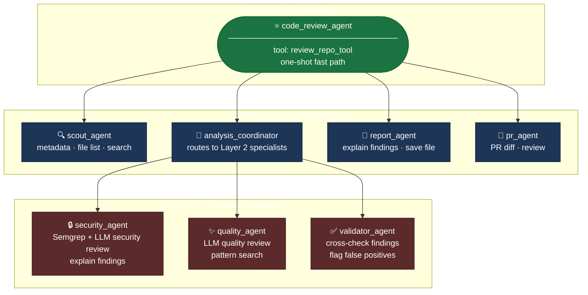

<div align="center">

# AI Code Review Agent

**Give it a GitHub URL. Get back a prioritized, security-first code review — powered by a multi-agent LLM pipeline.**

[](https://python.org)
[](https://google.github.io/adk-docs/)
[](https://ai.google.dev)
[](https://fastapi.tiangolo.com)
[](https://streamlit.io)
[](./tests)
[](https://github.com/Bardiyashavandi/code_review_agent/actions/workflows/ci.yml)
[](#multi-agent-architecture)
[](#multi-agent-architecture)
[](https://ai.google.dev/pricing)

**Kaggle 5-Day AI Agents Intensive Capstone — track: Agents for Business**

</div>

---

## Contents

- [Overview](#overview)
- [Multi-Agent Architecture](#multi-agent-architecture)
- [Pipeline Internals](#pipeline-internals)
- [What a run looks like](#what-a-run-looks-like)
- [Quick Start](#quick-start)
- [HTTP API](#http-api)
- [Observability](#observability)
- [Streamlit UI](#streamlit-ui)
- [Security, by design](#security-by-design)
- [Testing](#testing)
- [Real-world verification](#real-world-verification)
- [Project structure](#project-structure)
- [Known limitations](#known-limitations)
- [What this demonstrates](#what-this-demonstrates)

---

## Overview

Static analyzers find patterns but can't explain why they matter. LLMs can explain things but hallucinate when given no real grounding. This agent closes that gap: it fetches your actual repository, runs real Semgrep static analysis on it, and hands both the code and the findings to Gemini — so every issue in the final report is backed by a deterministic rule or a model that's actually reading your code, never a guess.

The pipeline is orchestrated by a **3-layer multi-agent system** built on Google ADK 2.3. Six specialized agents handle routing, analysis, and reporting — each with its own narrowly scoped tool set and instructions, rather than one monolithic agent doing everything.

> **No paid services.** Semgrep `--config auto`, Gemini Flash Lite, and the GitHub API are all free-tier. Hard constraint from day one.

---

## Multi-Agent Architecture

The system is a directed graph of **8 agents** across three layers. The root orchestrator routes every user request to the right specialist; the analysis coordinator decides whether to delegate to security, quality, validation, or all three.



```
┌─────────────────────────────────────────────────────────────────────────────┐
│  LAYER 0 — Orchestrator                                                     │
│                                                                             │
│                    ┌──────────────────────────┐                            │
│                    │    code_review_agent      │  tool: review_repo_tool   │
│                    │    (root orchestrator)    │  ← one-shot fast path     │
│                    └──────────┬───────────────┘                            │
└───────────────────────────────┼─────────────────────────────────────────────┘
                                │  sub_agents
          ┌─────────────────────┼──────────────┬──────────────┐
          │                     │              │              │
┌─────────▼─────────────────────▼──────────────▼──────────────▼──────────────┐
│  LAYER 1 — Domain Specialists                                               │
│                                                                             │
│  ┌─────────────┐  ┌──────────────────────┐  ┌─────────────┐  ┌──────────┐ │
│  │ scout_agent │  │ analysis_coordinator │  │report_agent │  │ pr_agent │ │
│  │             │  │                      │  │             │  │          │ │
│  │ · metadata  │  │ routes to security / │  │ · explain   │  │ · PR     │ │
│  │ · file list │  │ quality / validator  │  │   findings  │  │   diff   │ │
│  │ · search    │  │                      │  │ · save file │  │ · review │ │
│  └─────────────┘  └──────────┬───────────┘  └─────────────┘  └──────────┘ │
└─────────────────────────────────────────────────────────────────────────────┘
                               │  sub_agents (analysis_coordinator → Layer 2 only)
              ┌────────────────┼───────────────┐
              │                  │                  │
┌─────────────▼──────────────────▼──────────────────▼──────────────────────┐
│  LAYER 2 — Analysis Specialists                                           │
│                                                                           │
│  ┌──────────────────────┐  ┌──────────────────────┐  ┌─────────────────┐ │
│  │   security_agent     │  │    quality_agent      │  │ validator_agent │ │
│  │                      │  │                       │  │                 │ │
│  │ · fetch files        │  │ · fetch files         │  │ · cross-check   │ │
│  │ · Semgrep scan       │  │ · LLM quality review  │  │   findings vs   │ │
│  │ · LLM sec review     │  │ · pattern search      │  │   source code   │ │
│  │ · explain finding    │  │                       │  │ · flag false    │ │
│  │                      │  │                       │  │   positives     │ │
│  └──────────────────────┘  └──────────────────────┘  └─────────────────┘ │
└───────────────────────────────────────────────────────────────────────────┘
```

### Agent roles

| Agent | Layer | Role | Tools |
|---|---|---|---|
| `code_review_agent` | 0 | Root orchestrator — routes requests, handles quick one-shot reviews directly | `review_repo_tool` |
| `scout_agent` | 1 | Lightweight repo inspection — metadata, file listing, pattern search. No LLM review. | `get_repo_metadata_tool`, `fetch_repo_files_tool`, `search_code_in_files_tool` |
| `analysis_coordinator` | 1 | Decides security vs quality vs validation. Delegates to Layer 2 and aggregates results. | *(sub-agents only)* |
| `report_agent` | 1 | Deep-dive explanations of individual findings + saves Markdown reports to disk. | `explain_finding_tool`, `generate_report_file_tool` |
| `pr_agent` | 1 | Pull Request reviewer — fetches only changed files from a PR URL, not the whole repo. | `fetch_pr_files_tool`, `scan_code_tool`, `generate_review_tool`, `validate_findings_tool` |
| `security_agent` | 2 | Semgrep static analysis + LLM security-focused review. | `fetch_repo_files_tool`, `scan_code_tool`, `generate_review_tool`, `explain_finding_tool` |
| `quality_agent` | 2 | LLM quality/readability review — no Semgrep, no security angle. | `fetch_repo_files_tool`, `generate_review_tool`, `search_code_in_files_tool` |
| `validator_agent` | 2 | Cross-checks security findings against source code to flag false positives. | `validate_findings_tool` |

### How routing works

The root agent reads the user's intent and picks a path:

```
"quick review <url>"                       →  review_repo_tool (one call, done)
"what is this repo?"                       →  scout_agent
"security review <url>"                    →  analysis_coordinator → security_agent
"quality review <url>"                     →  analysis_coordinator → quality_agent
"full deep review <url>"                   →  analysis_coordinator → security_agent
                                                                   → validator_agent
                                                                   → quality_agent
"review this PR: github.com/.../pull/42"   →  pr_agent
"explain issue #3"                         →  report_agent
"save the report"                          →  report_agent
```

The `analysis_coordinator` uses ADK's `transfer_to_agent` to delegate down to Layer 2, waits for each specialist to return, then aggregates and presents combined findings. The `validator_agent` acts as a peer reviewer — after `security_agent` produces findings, the coordinator can optionally route to `validator_agent` to cross-check them against the actual source code before presenting results. All transfers are visible in the ADK Dev UI Traces panel in real time.

---

## Pipeline Internals

Under every agent's tool calls, the same three-stage pipeline runs:

```
  repo URL
     │
     ▼
┌──────────────────┐      GitHub REST API
│  github_fetcher  │ ──── (tree + blob endpoints)
│                  │
│  · walks the     │
│    repo tree     │
│  · pulls Python  │
│    files only    │
│  · skips venvs,  │
│    build dirs    │
└────────┬─────────┘
         │  List[FileResult]
         ▼
┌──────────────────┐      sandboxed subprocess
│  semgrep_runner  │ ──── (pipx-isolated binary)
│                  │
│  · writes files  │
│    to a temp dir │
│  · runs semgrep  │
│    --config auto │
│  · parses JSON   │
│    findings      │
└────────┬─────────┘
         │  files + findings
         ▼
┌──────────────────┐      Gemini Flash Lite
│ gemini_reviewer  │ ──── (google-genai SDK)
│                  │
│  · batches code  │
│    + findings    │
│  · structured    │
│    JSON response │
│  · retry on 429  │
│    / 503         │
└────────┬─────────┘
         │  ReviewReport
         ▼
┌──────────────────┐
│ report_generator │ ──── review_report.md
└──────────────────┘
```

| Stage | Module | What it does |
|---|---|---|
| **Fetch** | `github_fetcher.py` | Walks the repo tree via the GitHub REST API, pulls every `.py` file, strips venv/build noise |
| **Scan** | `semgrep_runner.py` | Writes files into an isolated sandbox, runs Semgrep, parses findings into typed `Finding` objects |
| **Review** | `gemini_reviewer.py` | Batches code + findings into prompts, calls Gemini for a structured, severity-ranked `ReviewReport` |

Only a fetch failure is fatal — there's nothing to review without files. Semgrep or Gemini failures are captured as non-fatal `StageError` entries so the pipeline always returns a usable, possibly degraded, result.

---

## What a run looks like

```
$ python3 main.py https://github.com/owner/repo --branch main --out review_report.md -v

Files fetched: 25  |  Semgrep findings: 2  |  Review issues: 23  |  Duration: 96.3s

── CRITICAL ──────────────────────────────────────────────────────────
Flask Debug Mode Enabled in Production                      app.py:115
  Running with debug=True in production exposes tracebacks, environment
  variables, and an interactive debugger capable of arbitrary code execution.
  Fix: set debug=False and gate it behind an environment-driven config.

Hardcoded Mock API Key                                      agent.py:95
  A string matching a real credential's prefix format is hardcoded. Even
  "mock" keys risk being mistaken for real ones or copied into production.
  Fix: load all keys from environment variables, never literals.

── HIGH ──────────────────────────────────────────────────────────────
...
```

That's a real run against a real, unmodified repository — not a mock.

---

## Quick Start

### Prerequisites

```bash
git clone https://github.com/Bardiyashavandi/code_review_agent
cd code_review_agent
python3 -m pip install -r requirements.txt
pipx install semgrep        # isolated — avoids opentelemetry conflicts
```

> **Why `pipx`?** `google-adk` and `semgrep` pin incompatible `opentelemetry` version ranges. `pipx` gives Semgrep its own isolated venv; `semgrep_runner.py` only ever shells out to the binary on `PATH`, so the isolation is invisible to the rest of the project.

### Environment

Create a `.env` in the project root:

```env
GITHUB_TOKEN=ghp_your_token_here
GEMINI_API_KEY=your_gemini_key_here
```

Both are free. Get them at [github.com/settings/tokens](https://github.com/settings/tokens) and [aistudio.google.com](https://aistudio.google.com).

---

### Option 1 — CLI

```bash
python3 main.py https://github.com/owner/repo --branch main --out review_report.md -v
```

`--max-files` (default `10`) caps how many Python files are reviewed — kept conservative for Gemini's free-tier daily limit. Raise it if you have quota.

---

### Option 2 — ADK Playground

```bash
adk web
```

Opens Google's ADK Dev UI at `http://127.0.0.1:8000`. Chat with the 3-layer agent system directly in a browser. The graph panel shows all 6 agents and their tool connections; the Traces panel shows every agent transfer and tool call in real time.

**Example prompts to try:**

```
scout https://github.com/Bardiyashavandi/code_review_agent
security review https://github.com/Bardiyashavandi/code_review_agent
quality review https://github.com/Bardiyashavandi/code_review_agent
full deep review https://github.com/Bardiyashavandi/code_review_agent
quick review https://github.com/Bardiyashavandi/code_review_agent
review this PR: https://github.com/owner/repo/pull/42
```

---

### Option 3 — HTTP API

```bash
uvicorn server:app --reload
```

```bash
curl -s -X POST http://127.0.0.1:8000/analyze \
     -H "Content-Type: application/json" \
     -d '{"repo_url": "https://github.com/owner/repo", "max_files": 10}' \
     | python3 -m json.tool
```

---

### Option 4 — Streamlit UI

Both processes must run simultaneously — the UI calls the API server:

```bash
# Terminal 1
uvicorn server:app --reload

# Terminal 2
streamlit run streamlit_app.py
```

Opens at `http://localhost:8501`.

---

## HTTP API

`server.py` wraps `CodeReviewAgent.review_repo()` behind a FastAPI endpoint — same internal logic, different entrypoint.

**Interactive docs:** `http://127.0.0.1:8000/docs` (Swagger UI, auto-generated from Pydantic models)

### `POST /analyze`

**Request:**

```json
{
  "repo_url":  "https://github.com/owner/repo",
  "branch":    "main",
  "max_files": 10
}
```

**Response `200`:**

```json
{
  "repo_url":      "https://github.com/owner/repo",
  "duration_s":    11.1,
  "files_fetched": 5,
  "truncated":     false,
  "review": {
    "summary":        "2 issues found...",
    "model":          "gemini-3.1-flash-lite",
    "files_reviewed": 5,
    "duration_s":     1.8,
    "issues": [
      {
        "path":          "auth.py",
        "line":          42,
        "severity":      "HIGH",
        "title":         "Hardcoded secret",
        "description":   "...",
        "suggested_fix": "...",
        "rule_id":       null
      }
    ]
  },
  "scan": {
    "scanned":    5,
    "skipped":    [],
    "duration_s": 4.3,
    "findings":   []
  },
  "stage_errors": []
}
```

**Error codes:**

| Status | Cause |
|---|---|
| `400` | Bad config state (`AgentError`, `ValueError`) |
| `401` | GitHub token invalid or expired |
| `404` | Repository not found or private |
| `422` | Invalid request body (bad URL, `max_files` out of 1–500 range) |
| `429` | GitHub API rate limit hit |
| `500` | Unexpected internal error (logged server-side) |
| `502` | GitHub API error unrelated to auth/rate-limit/not-found |
| `504` | Pipeline exceeded timeout — try smaller `max_files` or raise `AGENT_TIMEOUT_S` |

### `GET /health`

```json
{ "status": "ok" }
```

Credentials stay server-side and are never passed by the caller.

---

## Observability

Every pipeline run emits structured JSON spans to `traces/trace.jsonl` (appended, never overwritten). Three levels are captured:

```
run span          ← wraps the entire review_repo() call
  └─ stage span   ← fetch / scan / review
       └─ llm_call span  ← each Gemini generate_content() call
```

Each LLM span records token counts, prompt size, retry count, and latency. The run span records files fetched, findings, issues, and total duration.

**View traces:**

```bash
python3 view_trace.py              # last full run as an indented tree
python3 view_trace.py --tail 20    # last 20 spans, flat, across runs
python3 view_trace.py --list       # all runs with timestamps and status
python3 view_trace.py --run a3f1   # specific run by id prefix
```

**Example tree:**

```
▶ RUN  review_repo  ✓  11.47s  run_id=a3f1c2d4
  2026-07-15 10:23:01 UTC
  repo_url:  https://github.com/owner/repo
  branch=main · max_files=10
  23 files fetched · 2 semgrep findings · 5 issues

  ├─ STAGE  fetch  ✓  1.23s
  │    files_fetched=23 · truncated=False

  ├─ STAGE  scan  ✓  4.28s
  │    scanned=23 · findings=2 · skipped=0

  ├─ STAGE  review  ✓  5.87s
  │    files_reviewed=23 · issues=5 · model=gemini-3.1-flash-lite
  │    └─ LLM  gemini_call  batch=0  ✓  1.92s
  │         prompt_chars=18234 · tokens=1205→312 (1517 total) · retries=0
  │    └─ LLM  gemini_call  batch=1  ✓  1.85s
  │         prompt_chars=15612 · tokens=1156→298 (1454 total) · retries=0

  Gemini calls today: 2 / 500  [█░░░░░░░░░░░░░░░░░░░]  1%
```

`traces/` is gitignored — runtime data, not source.

---

## Streamlit UI

`streamlit_app.py` is a browser UI that calls `server.py` over HTTP. It contains no agent logic itself.

**What you get:**

Two tabs:

**▶ Review tab**
- Repo URL input with client-side validation
- Branch and max-files controls
- Color-coded severity badges: `CRITICAL` `HIGH` `MEDIUM` `LOW`
- Expandable issue cards: file, line, description, suggested fix
- Semgrep findings with actual code snippets (`st.code`)
- Metrics row: files fetched, issues found, duration, model used
- Specific readable error messages for every failure mode — never a raw traceback

**📊 History tab**
- Summary metrics: total runs, success rate, average issues, average duration
- Bar charts: issues-per-run and duration-per-run (reads from `/traces` on the server)
- Expandable run cards with per-run metrics and stage-error warnings

Point at a remote server: `REVIEW_API_URL=https://your-server.example.com streamlit run streamlit_app.py`

---

## Security, by design

Every layer of the stack has explicit security decisions:

| Layer | Decision |
|---|---|
| **Subprocess** | All `semgrep` calls use explicit argument lists — never `shell=True` |
| **File paths** | Repo paths are validated against path traversal before touching disk |
| **Semgrep config** | `--config` argument is allow-listed by regex against argument injection |
| **Prompt injection** | Gemini's system prompt instructs the model to treat all file contents and Semgrep output as **untrusted data, not instructions** — tested with a live injected payload |
| **Credentials** | API keys load from environment variables only; `test_secrets_never_logged` asserts no key ever appears in a log line or exception message |
| **Output rendering** | Model output is never evaluated as code or interpolated unsafely into the Streamlit UI — tested with an injected `__import__` payload |

---

## Testing

```bash
pytest -v
```

107 tests across all five modules. Every external dependency — GitHub API, Semgrep subprocess, Gemini SDK — is mocked, so the full suite runs in under a second with no network access or credentials required.

---

## Real-world verification

A real end-to-end run — not a test fixture — fetched 25 files, ran a live Semgrep scan, called Gemini, and produced a 23-issue report in 96 seconds. Genuine findings: a Flask app in debug mode, a hardcoded mock API key, an endpoint trusting a client-supplied ID.

That run also surfaced three integration bugs no mock could have caught:

| Bug | Root cause | Fix |
|---|---|---|
| Dependency conflict | `google-adk` and `semgrep` pin incompatible `opentelemetry` ranges | Isolated Semgrep into `pipx` |
| Stale env var | `python-dotenv` won't override an already-exported variable | Load `.env` with `override=True` |
| macOS symlink bug | macOS resolves its temp dir through `/private/...`; path comparison that works on Linux raised `ValueError` on a real Mac | Normalize paths before comparison |

The multi-agent system was verified live in Google's ADK Dev UI playground — agent transfers visible in the Traces panel, the 3-layer graph rendered correctly with all 6 nodes.

---

## Project structure

```
code_review_agent/
│
├── Core pipeline
│   ├── github_fetcher.py         # Stage 1: fetch Python files via GitHub API
│   ├── semgrep_runner.py         # Stage 2: run Semgrep, parse findings
│   ├── gemini_reviewer.py        # Stage 3: LLM review via Gemini Flash Lite
│   └── report_generator.py       # Render PipelineResult → Markdown
│
├── Orchestration
│   └── agent.py                  # CodeReviewAgent + 3-layer 8-agent ADK graph
│                                 #   (build_multi_agent_system → root_agent)
│                                 #   agents: root · scout · analysis_coordinator
│                                 #           pr_agent · report_agent
│                                 #           security · quality · validator
│
├── Entry points
│   ├── main.py                   # CLI: python3 main.py <url>
│   ├── server.py                 # HTTP API: FastAPI, POST /analyze
│   ├── streamlit_app.py          # Browser UI: calls server.py over HTTP
│   └── adk_demo.py               # Standalone ADK tool-calling demo
│
├── Observability
│   ├── tracing.py                # Span context manager → traces/trace.jsonl
│   └── view_trace.py             # CLI viewer: tree / flat / list / RPD counter
│
├── Specs (written before code)
│   └── *_spec.md                 # Interface, behavior, error hierarchy, test table
│
└── Tests
    └── tests/                    # 107 tests, one file per module, all mocked
```

---

## Known limitations

- `--config auto` requires reaching `semgrep.dev`'s rule registry over the network; air-gapped or egress-restricted environments need a local ruleset.
- Gemini occasionally returns transient `503` errors under high demand — `gemini_reviewer.py` retries with exponential backoff, but a sustained outage surfaces as a non-fatal `StageError`.
- Free-tier Gemini keys cap total requests per day. `--max-files` defaults to `10` and batches include a short inter-batch delay specifically to stretch that quota.
- `server.py` runs locally only — cloud deployment would require a billing-enabled project, which conflicts with this project's no-paid-services constraint.

---

## What this demonstrates

**Spec-driven development.** Every module started as a written spec (interface, behavior, error hierarchy, test table) before any implementation code. The `*_spec.md` files are the visible record of that.

**Genuine multi-agent architecture.** Eight agents across three layers — root orchestrator, four domain specialists (scout, coordinator, PR reviewer, reporter), and three analysis agents (security, quality, validator). Each has a narrow role, focused instructions, and only the tools it actually needs. The `validator_agent` acts as a peer reviewer, cross-checking the `security_agent`'s findings against actual source code to filter false positives before results reach the user. Agent-to-agent transfers are explicit and visible in the ADK playground. A dedicated `pr_agent` reviews only the changed files in a Pull Request — not the whole repo.

**Four access surfaces, one pipeline.** The same `CodeReviewAgent` is reachable via CLI (`main.py`), HTTP API (`server.py`/FastAPI), browser chat (`adk web`/ADK Dev UI), and a visual web UI (`streamlit_app.py`/Streamlit) — without duplicating any logic.

**Full observability.** `tracing.py` emits structured JSON spans (run → stage → LLM call) to `traces/trace.jsonl`. `view_trace.py` renders them as an annotated tree with token counts, retries, and a live Gemini RPD counter.

**Security first, zero cost.** Semgrep `--config auto`, Gemini Flash Lite, and the GitHub API are all free-tier. No paid services, by hard constraint from day one.

Full writeup: [`KAGGLE_WRITEUP.md`](./KAGGLE_WRITEUP.md)

---

<div align="center">

MIT License — see [`LICENSE`](./LICENSE)

</div>
